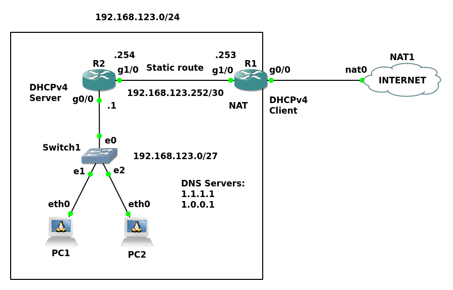

# zcu-kiv-psi-4

This is the fourth KIV/PSI project. A simple network configuration with real devices running inside
[GNS3](https://en.wikipedia.org/wiki/Graphical_Network_Simulator-3).

## Topology



## Devices

- **R1, R2:** Cisco 7200 routers running Cisco IOS 15.0 operating system.
- **Switch1:** Some dumb switch with all ports in the same VLAN.
- **PC1, PC2:** Some computers running Alpine Linux operating system. See downloadable appliances in GNS3.

## Configuration

The following listings contain all the console commands required to configure the network above.

### Router R1

```
configure terminal
```

WAN interface:

```
interface gigabitEthernet 0/0
ip address dhcp
ip nat outside
no shutdown
exit
```

LAN interface:

```
interface gigabitEthernet 1/0
ip address 192.168.123.253 255.255.255.252
ip nat inside
no shutdown
exit
```

Route to the LAN network:

```
ip route 192.168.123.0 255.255.255.0 gigabitEthernet 1/0
```

NAT between LAN and WAN:

```
access-list 1 permit 192.168.123.0 0.0.0.255
ip nat inside source list 1 interface gigabitEthernet 0/0 overload
```

### Router R2

```
configure terminal
```

LAN interface:

```
interface gigabitEthernet 0/0
ip address 192.168.123.1 255.255.255.224
no shutdown
exit
```

WAN interface:

```
interface gigabitEthernet 1/0
ip address 192.168.123.254 255.255.255.252
no shutdown
exit
```

Default route via R1:

```
ip route 0.0.0.0 0.0.0.0 192.168.123.253
```

DHCP server with a pool of 20 IP addresses:

```
ip dhcp excluded-address 192.168.123.1 192.168.123.10
ip dhcp pool R2_LAN
network 192.168.123.0 255.255.255.224
default-router 192.168.123.1
dns-server 1.1.1.1 1.0.0.1
exit
```

### Computers PC1 and PC2

Run DHCPv4 client to acquire network settings:

```
udhcpc
```

## Testing

Both PC1 and PC2 should now have internet connectivity. You can test it by pinging some public server:

```
ping seznam.cz
```

Here is an example output:

```
PING seznam.cz (77.75.74.172): 56 data bytes
64 bytes from 77.75.74.172: seq=0 ttl=57 time=32.164 ms
64 bytes from 77.75.74.172: seq=1 ttl=57 time=51.741 ms
64 bytes from 77.75.74.172: seq=2 ttl=57 time=41.580 ms
64 bytes from 77.75.74.172: seq=3 ttl=57 time=50.964 ms
```
